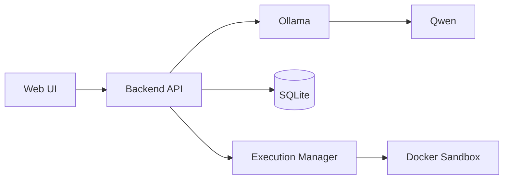
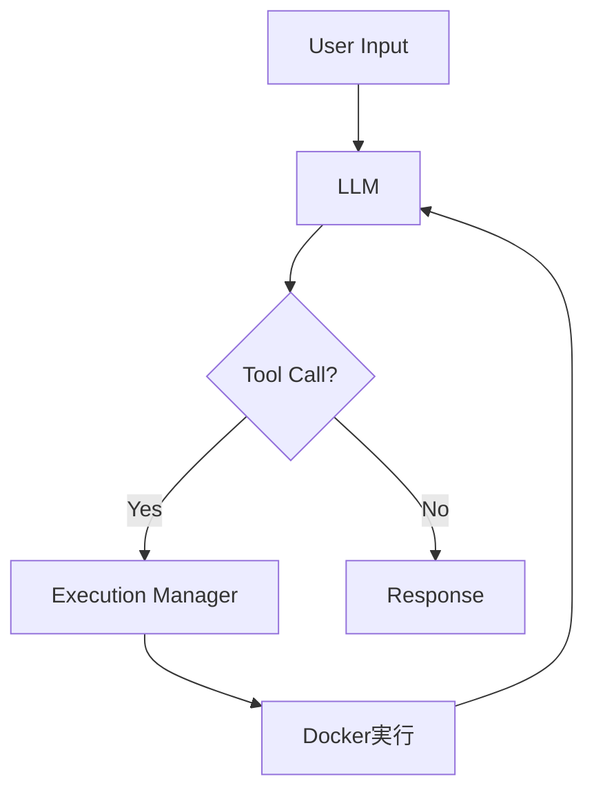
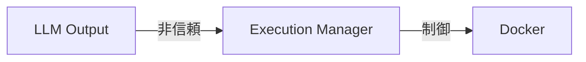

# 要件定義書：ローカルAIエージェント（Docker隔離前提）

---

# 0. 設計思想（最重要）

```
LLMは信用しない
生成コードは完全に不正入力として扱う
```

---

# 1. システム構成



---

# 2. コンポーネント定義

---

## 2.1 Backend API（FastAPI）

責務：

- リクエスト受付
- プロンプト生成
- エージェント制御
- ツール実行のオーケストレーション

---

## 2.2 Execution Manager（新規追加）

責務：

- Docker実行制御
- コード検証
- 実行ログ管理

👉 セキュリティの中核

---

## 2.3 Docker Sandbox

責務：

- 非信頼コードの実行
- 完全隔離

---

# 3. 機能要件（更新）

---

## 3.1 チャット機能

### 要件

- ユーザー入力を受け取りLLMに送信
- 応答を表示

### 入力

- text: string

### 出力

- response: string

---

## 3.2 エージェント機能

### フロー



---

## 3.3 ツール実行（重要変更）

---

### ツール一覧

| ツール | 実行方式 |
| --- | --- |
| file_read | ホスト直接 |
| file_write | ホスト制限付き |
| run_python | Docker |
| run_shell | Docker |

---

### run_python仕様

### 入力

```json
{
  "code": "print('hello')"
}
```

---

### 実行手順

1. 一時ファイル生成
2. Dockerコンテナ起動
3. ファイルをコンテナにマウント
4. 実行
5. stdout/stderr取得
6. コンテナ削除

---

# 4. Docker要件

---

## 4.1 実行ポリシー

```
1リクエスト = 1コンテナ
```

---

## 4.2 セキュリティ設定（必須）

```bash
--rm
--network none
--memory 512m
--cpus 1
--pids-limit 100
--read-only
--security-opt no-new-privileges
```

---

## 4.3 ファイルシステム

- 書き込み可能領域：
    - `/tmp` のみ

---

## 4.4 ベースイメージ

- python:3.11-slim

---

## 4.5 タイムアウト

- 実行上限：5秒

---

# 5. Execution Manager仕様

---

## 5.1 インターフェース

```python
def execute_python(code: str) -> dict:
    return {
        "stdout": "...",
        "stderr": "...",
        "exit_code": 0
    }
```

---

## 5.2 バリデーション

### 最低限

- 危険コマンド検知（例）

```
os.system
subprocess
```

※ただし完全防御は不可能

---

## 5.3 ログ管理

- 実行履歴保存
- エラー記録

---

# 6. セキュリティ要件（追加）

---

## 6.1 禁止事項

- ホストの任意ファイルアクセス
- ネットワーク通信
- 永続プロセス

---

## 6.2 信頼境界



---

# 7. 非機能要件（更新）

---

## 7.1 パフォーマンス

| 項目 | 要件 |
| --- | --- |
| コンテナ起動 | < 1秒 |
| 実行時間 | < 5秒 |

---

## 7.2 リソース制御

- 同時実行数制限：最大2

---

# 8. エラー処理

---

| ケース | 対応 |
| --- | --- |
| タイムアウト | 強制終了 |
| メモリ超過 | kill |
| 実行失敗 | stderr返却 |

---

# 9. データ設計（追加）

---

## executions テーブル

```sql
CREATE TABLE executions (
    id INTEGER PRIMARY KEY,
    code TEXT,
    stdout TEXT,
    stderr TEXT,
    created_at DATETIME
);
```

---

# 10. リスク分析（更新）

---

## ❗完全防御は不可能

- Docker escape（低確率）

## ❗性能低下

- コンテナ起動コスト

## ❗UX劣化

- 実行待ち時間

---

# 11. MVPスコープ（修正）

---

## 必須

- チャット
- プロファイル
- Docker経由run_python

## 除外

- shell実行（初期は危険）

---

# 12. 拡張計画

---

## Phase2

- セキュアなshell対応
- キャッシュ

## Phase3

- マルチコンテナ並列実行

---

# 13. 一言でまとめ

> 「LLMを信用しない前提で、Dockerを境界にした安全な実行基盤を構築する」
> 

---